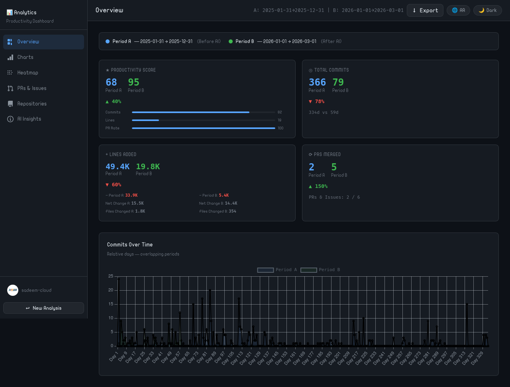
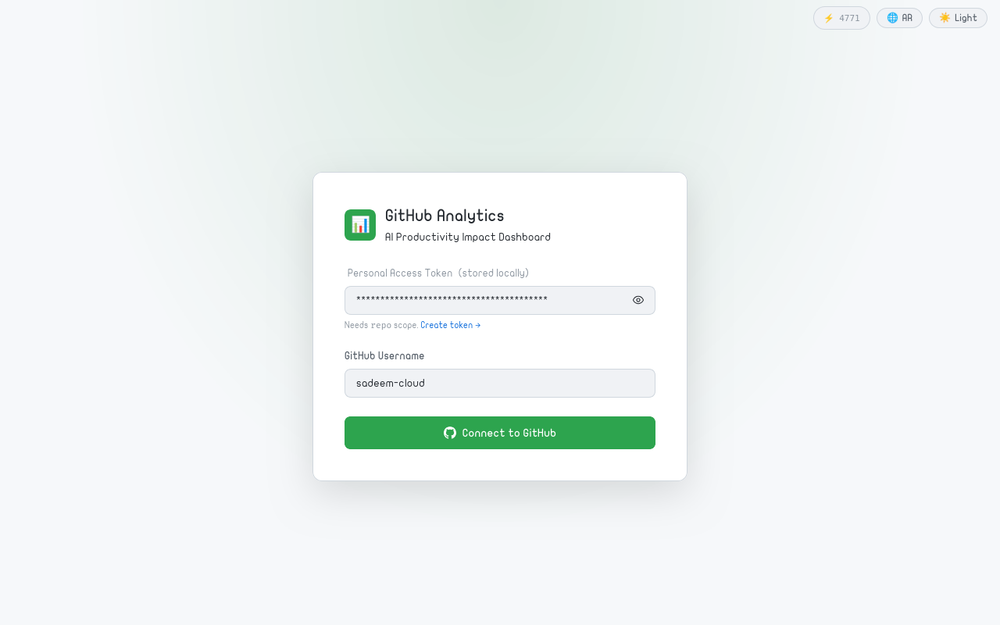
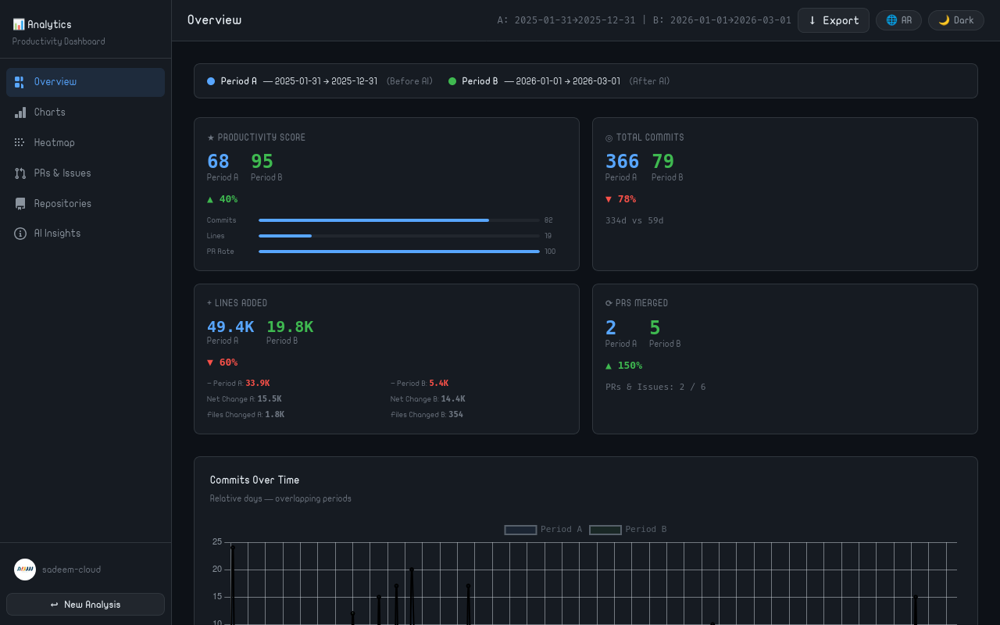
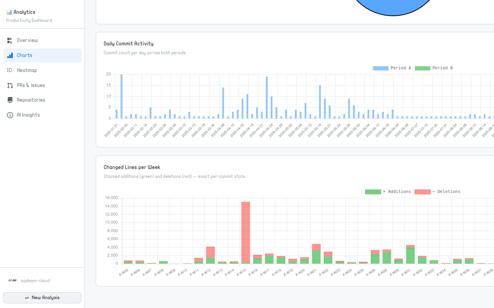
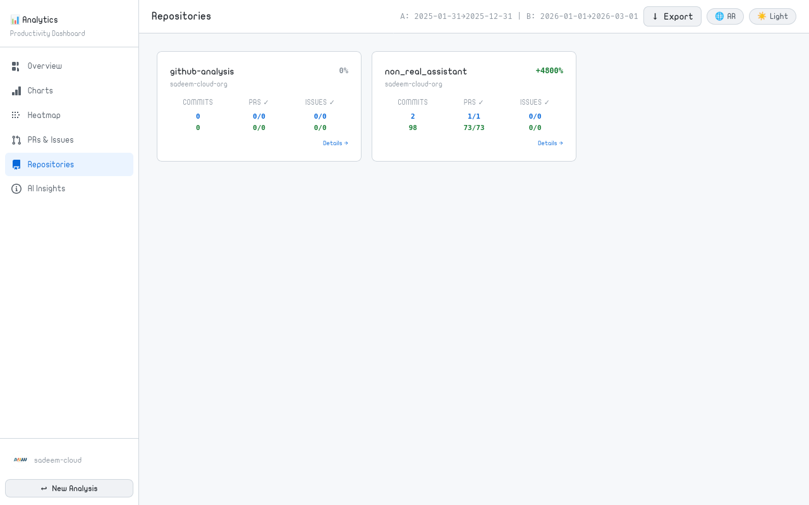

<div align="center">

# 📊 GitHub Productivity Analytics

**Measure the real impact of AI coding tools on your development workflow.**
A zero-dependency, single-file dashboard that compares two time periods side-by-side — before and after adopting AI assistants like GitHub Copilot, Cursor, or Claude.

[](https://your-username.github.io/GithubDashboard/)
[]()
[-3fb950?style=for-the-badge)]()
[]()



</div>

---

## ✨ What It Does

Drop your GitHub Personal Access Token in, pick your repositories and date ranges, and get an instant **data-driven answer** to: *"Did AI tools actually make me more productive?"*

The dashboard fetches your real GitHub activity, computes a composite **Productivity Score**, and renders everything as interactive charts, heatmaps, and auto-generated insights — entirely in the browser. No server. No account. No tracking.

---

## 🚀 Features

### 📈 Productivity Score
A weighted composite metric combining commit frequency, lines of code, files changed, and PR throughput — normalized between periods so you can compare apples to apples.

### 🗂 6 Dashboard Sections

| Section | What you get |
|---|---|
| **Overview** | KPI cards with delta %, commits-over-time line chart |
| **Charts** | Code volume, language breakdown, daily activity bar, changed lines per week |
| **Heatmap** | Side-by-side calendar heatmaps for both periods |
| **PRs & Issues** | Per-repository table with merge times and issue close rates |
| **Repositories** | Card grid with per-repo stats + click-to-expand modal with recent commits |
| **AI Insights** | Auto-generated analysis paragraphs in **English and Arabic** |

### 📤 Export Everything
- **JSON** — full raw data payload
- **CSV Summary** — all metrics in one spreadsheet-ready file
- **CSV Commits** — per-commit log for either period
- **PNG Charts** — export any individual chart as an image
- **All Charts** — download all 5 charts as PNGs in one click

### 🌍 Bilingual & Themeable
- Full **Arabic / English** UI toggle with RTL layout support
- **Dark / Light** theme toggle
- Persists your preferences in `localStorage`

### ⚡ Smart API Usage
- Paginated GitHub API calls (`per_page=100`)
- Live **rate-limit badge** showing remaining requests
- Retry logic for stats endpoints (GitHub returns `202` while computing)
- Batched concurrent commit-stat fetching (max 10 in parallel)

---

## 🛠 How to Use

### Option A — Open directly (no server needed)
```
git clone https://github.com/your-username/GithubDashboard.git
open index.html
```

### Option B — GitHub Pages
1. Fork this repo
2. Go to **Settings → Pages → Source → main branch / root**
3. Your dashboard is live at `https://your-username.github.io/GithubDashboard/`

### Option C — Any static host
Just upload `index.html` to Netlify, Vercel, S3, or any web server. One file, done.

---

## 🔑 GitHub Token Setup

The dashboard needs a **Personal Access Token** with `repo` scope to read your commit and PR history.

1. Go to [github.com/settings/tokens/new](https://github.com/settings/tokens/new?scopes=repo&description=Productivity+Analytics)
2. Check the `repo` scope
3. Click **Generate token** and paste it in the setup screen

> Your token is stored only in your browser's `localStorage`. It is never sent anywhere except directly to the GitHub API.

---

## 📐 Architecture

```
index.html  (~2,450 lines, ~90 KB)
│
├── CSS          Design tokens, dark/light theme, RTL, all component styles
├── HTML         4 screens: Setup → Config → Dashboard → (modal overlays)
└── JavaScript
    ├── i18n     English + Arabic translation map
    ├── API      ghPaginate(), ghStats(), ghJson() — all GitHub calls
    ├── Render   Chart.js charts, heatmap, KPI cards, PR table, repo cards
    ├── Score    calcScore() + normalizeScore() — productivity formula
    ├── Export   JSON / CSV / PNG / all-charts
    └── UI       Theme, language, navigation, modal, keyboard shortcuts
```

**Dependencies:** [Chart.js 4.4.0](https://www.chartjs.org/) via CDN — that's it.

---

## 📊 Productivity Score Formula

```
score = (commitFreq × 30) + (linesPerDay × 0.5) + (mergedPRs × 5) + (filesPerDay × 2)
```

Both periods are then normalized to a 0–100 scale so the scores are always comparable regardless of period length.

---

## 🖼 Screenshots

<table>
  <tr>
    <td><b>Setup Screen</b></td>
    <td><b>Overview (Dark)</b></td>
  </tr>
  <tr>
    <td></td>
    <td></td>
  </tr>
  <tr>
    <td><b>Charts Section</b></td>
    <td><b>Repository Details Modal</b></td>
  </tr>
  <tr>
    <td></td>
    <td></td>
  </tr>
</table>

---

## 🤝 Contributing

Issues and PRs are welcome. Since the entire app is one HTML file, contributions are as simple as editing `index.html`.

```bash
git clone https://github.com/your-username/GithubDashboard.git
cd GithubDashboard
# Edit index.html, open in browser, done.
```

---

## 📄 License

MIT — use it, fork it, embed it, ship it.

---

<div align="center">
  <sub>Built with vanilla HTML + CSS + JS. No build tools. No frameworks. No nonsense.</sub>
</div>
